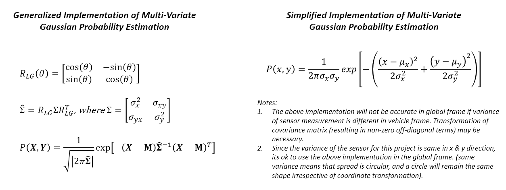
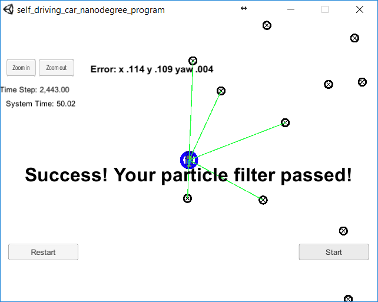
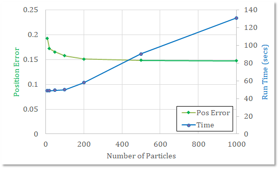

# 1. Term 2 Kidnapped Vehicle Project Report

The writeup briefly describes the implementation of the Particle Filter algorithm for the *Kidnapped Vehicle Project* code needed to complete the final project for the Localization course in Udacity's Self-Driving Car Nanodegree.

<!-- TOC -->

- [1. Term 2 Kidnapped Vehicle Project Report](#1-term-2-kidnapped-vehicle-project-report)
    - [1. Configuration, Build and Run Process](#1-configuration-build-and-run-process)
    - [2. Source Code Implementation](#2-source-code-implementation)
        - [2.1. Overview of Steps for Particle Filter](#21-overview-of-steps-for-particle-filter)
        - [2.2. Initialization](#22-initialization)
        - [2.3. Prediction](#23-prediction)
        - [2.4. Association](#24-association)
        - [2.5. Update](#25-update)
        - [2.6. Resample](#26-resample)
    - [3. Results and Discussions](#3-results-and-discussions)
        - [3.1. Submission](#31-submission)

<!-- /TOC -->

---

## 1. Configuration, Build and Run Process

* For this project, Windows 10 x64 WSL (Ubuntu 16.04) build environment was used. The core dependencies (cmake >=3.5, make >= 4.1, gcc/g++ >= 5.4) are already a part of this system.
* [uWebSockets](https://github.com/uWebSockets/uWebSockets) was installed using `install-ubuntu.sh`.
* [Eigen](http://eigen.tuxfamily.org/index.php?title=Main_Page) was utilized for this code. Relevant source folder is included.
* The term 2 simulator was downloaded from the [release](https://github.com/udacity/self-driving-car-sim/releases) section of the repository.
* The build for MPC project was done  using command `mkdir build && cd build && cmake .. && make`. The exectuable was run using `./particle_filter`. The executable (server) waits for uWebSockets connection from Term 2 Simulation (client). Once connection is established, the executable recieves "telemetry" data from the client and sends back particle filter data for visualization of best and average particles.

## 2. Source Code Implementation

 The majority of the implementation was done in the `particle_filter.cpp` file. Other source files are tweaked slightly to improve compatibility with source implementation in the `particle_filter.cpp` file. In the following, key portions of the source code implemented in `particle_filter.cpp` file is discussed.

### 2.1. Overview of Steps for Particle Filter

The major implementation steps for particle filter algorithm are:
 1. Initialization
 2. Prediction
 3. Association
 4. Update
 5. Resample

### 2.2. Initialization

Initialization is done between lines 26-52 of `particle_filter.cpp` file. Here, normal distribution generator is initialized using following code. It is noted here that the random number generator is initialized outside `for` loop using a zero mean and specified standard deviation to improve code efficiency.

``` c++
default_random_engine gen;
normal_distribution<double> dist_x(0.0, std[0]);
normal_distribution<double> dist_y(0.0, std[1]);
normal_distribution<double> dist_theta(0.0, std[2]);
```

Further, depending on number of particles defined, the particle vector is initialized.

``` c++
particles.clear();
for (int i = 0; i < num_particles; i++) {
    Particle p;
    p.id = i;
    p.x = x + dist_x(gen);
    p.y = y + dist_y(gen);
    p.theta = theta + dist_theta(gen);
    p.weight = 1.0;
    particles.push_back(p);
    weights.push_back(1.0);
}
```

### 2.3. Prediction

In the prediction step, all the particles are update using the motion model and the sensor data (velocity and yaw rate). Furthermore, the equations of motion model used for prediction are change depending on the current yaw rate.

``` c++
for (int i = 0; i < num_particles; i++) {
    // Update based on motion model
    if(thetad<0.001) {
        particles[i].x += dist_x(gen) + v*dt*cos(particles[i].theta);
        particles[i].y += dist_y(gen) + v*dt*sin(particles[i].theta);
    } else {
        particles[i].x += dist_x(gen)
            + (v/thetad)*(sin(particles[i].theta+thetad*dt)
                            -sin(particles[i].theta));
        particles[i].y += dist_y(gen)
            + (v/thetad)*(cos(particles[i].theta)
                            -cos(particles[i].theta+thetad*dt));
    }
    particles[i].theta += dist_theta(gen) + thetad*dt;
}
```

### 2.4. Association

The observations predicted by each particle are transformed to global frame and stored in `LandmarkObs` vector.

``` c++
predicted_vec.clear();
for(int j=0; j<obs_lm.size(); j++) {
    LandmarkObs pred_temp;
    ptx_vec << particles[i].x, particles[i].y;
    obs_vec << obs_lm[j].x, obs_lm[j].y;
    glb_vec = rot_L2G*obs_vec + ptx_vec;
    pred_temp.id = -1;
    pred_temp.x = glb_vec[0];
    pred_temp.y = glb_vec[1];
    predicted_vec.push_back(pred_temp);
}
```

Similarly, the ground truth landmark positions obtained from the simulator are also processed and only those within sensor range are stored in a vector.

``` c++
observations_vec.clear();
for(int k=0; k<lm_list.size(); k++) {
    d_range = dist(particles[i].x, particles[i].y,
                    lm_list[k].x_f, lm_list[k].y_f);
    if(d_range <= sensor_range) {
        LandmarkObs obs_temp;
        obs_temp.id = lm_list[k].id_i;
        obs_temp.x = lm_list[k].x_f;
        obs_temp.y = lm_list[k].y_f;
        observations_vec.push_back(obs_temp);
    }
}
```

These two vectors (`predicted_vec` and `observation_vec`) are then associated. For each particle, the observation is associated to closest ground truth landmark. This information will be used during the update process.

### 2.5. Update

The update is performed for each particle by looping over the predictions and ground truth observation and obtaining overall probability of all landmarks being sensed. A simplified implementation of multi-variate Gaussian was utilized to compute the probability of match between prediction and ground truth observation.

``` c++
p_weight = 1.0;
double num, den;
for(int j=0; j<predicted_vec.size(); j++) {
    for(int k=0; k<observations_vec.size(); k++) {
        if(predicted_vec[j].id != observations_vec[k].id) continue;
        // Simple implementation assuming no cross-correlation
        num = pow((predicted_vec[j].x-observations_vec[k].x),2)
                / (2.0*pow(std_lm[0],2))
            + pow((predicted_vec[j].y-observations_vec[k].y),2)
                / (2.0*pow(std_lm[1],2));
        double den = (2.0*M_PI*std_lm[0]*std_lm[1]);
        p_weight *= exp(-num/den);
    }
}
particles[i].weight = p_weight;
weights.push_back(p_weight);
w_sum += p_weight;
```

Note that the summation `W_sum` is used again to normalize the `weights` vector. This is done to ensure that the particle weights sum to 1.0, and this will be useful during the resampling step when using `discrete_distribution`.

The general case of estimating particle weights during the update step using the multi-variate Gaussian distribution is as follows. Note, that the covariance of sensor measurements has zero off-diagonals in the vehicle frame. However, if the probability is being assessed in the global frame, the covariance matrix will have to be transformed. In this case, it is not guaranteed that the off-diagonal terms will be zeros. The following image gives an overview of how a generalized implementation of MVGP estimation can be implemented. The `particle_filter.cpp` file has this implementation in comments.



### 2.6. Resample

The resampling step is simple to implement, yet a critical one. The normalized weights obtained from the udpate step are used to draw discrete particles with equivalent normal distribution. The new particles are drawn from the current pool of particles which closely represent the ground truth measurements.

```c++
discrete_distribution<int> dist(weights.begin(), weights.end());
std::vector<Particle> new_particles;
new_particles.clear();
for (int i = 0; i < num_particles; i++) {
    new_particles.push_back(particles[dist(gen)]);
}
```

## 3. Results and Discussions

The implementation of the particle filter for *Kidnapped Vehicle* project was successfully completed. A screen grab of the completed project being run in the simulator is shown below. A screencast of the simulator in action can be seen [here](./PF_Output_N100.mp4).



The effect of choice of number of particles on the performance and run-time was also investigated. The results are shown below. It is interesting to see that the accuracy (*Position Error*) of the filter saturates above 100-200 particles. There is no performance gain in choosing more than 200 particles as the run-time is severely compromised. Although the code can be optimized further to get more efficiency, for this project no further code optimization or profiling was attempted. It is noted that for ~1000 particles, the simulator timed-out.



The following performance was obtained from the particle filter.

1. **Accuracy**: Particle filter is able localize vehicle position and yaw to within errors 0.15 and 0.004, respectively.

2. **Performance**: For choice of 100 particles, the simulator completed in 30 seconds. However, there is a steep increase in run-time above 200 particles.

### 3.1. Submission
The source code (`particle_filter.cpp`) is uploaded as a zip file. The file is a drop-in replacement into the reviewer's reposity and is compatible with `cmake` and `make`. Please see [GitHub repository](https://github.com/svanimisetti/CarND-Kidnapped-Vehicle-Project) for the project report in README.md.
